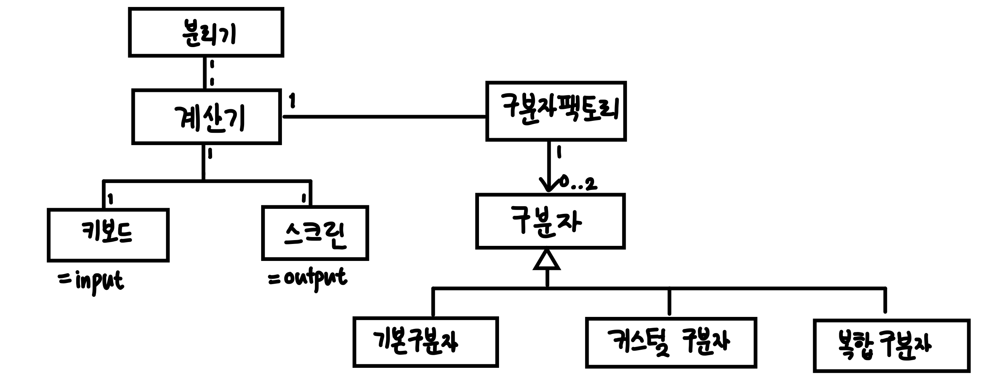

# java-calculator-precourse

# 구현할 기능 목록

> 요구사항에 기능에 따른 커밋을 하라고 기재되어 있으므로, 
> 다음과 같이 기능을 명확히 분리했습니다.  
> 커밋 시 이 기능 외의 테스트, 리펙토링, 문서화 등의 커밋이 추가될 수 있습니다.

- 계산하기
    -[ ] 계산기 구축
    -[ ] 덧셈 설정
- 구분자 찾기
    -[X] 구분자 판별
    -[X] 구분자 만들기
- 숫자 분리하기
    -[ ] 문자열을 구분자로 분리
    -[ ] 예외 처리
- UI
    -[ ] 입력 구현
    -[ ] 출력 구현
    -[ ] 전체 흐름 제어 애플리케이션 컨트롤러 구현

# 비기능적 요구사항

> 다음은 기능 외에 필요한 추가적인 사항입니다. 
> 설계, 리펙토링, 테스트에 관한 부분입니다.  
> 핵심 기능은 아니지만, 품질관리에 필요하기에 기능들 사이에 추가적으로 커밋이 추가될 수 있습니다.

- 설계
    - 도메인 모델 구축
- 리펙토링
    - 패턴 적용
    - 응집도를 높이고 결합도를 낮추자
- 테스트
    - 단위테스트
    - 통합테스트

# 커밋 컨벤션

기본적인 커밋 단위는 위의 설정한 기능 단위로 하며,
그 외의 세부적인 리펙토링, 테스트 등은 따로 작성하겠습니다.

이 경우 커밋 메시지 맨 앞에 타입을 붙여 명확히 명시하겠습니다.

- 기능 구현: `feat`
- 테스트 작성: `test`
- 리펙토링: `refactor`
- 문서화: `docs`

# 설계

### 설계 목표

- 높은 응집도와 낮은 결합도: 각 객체의 책임을 명확히 하여 변경의 파급효과를 최소화하고자 했습니다.
- 확장성: 미래에 새로운 기능이 추가되거나, 변경되어도 유연하게 대처가 가능한 구조를 목표로 했습니다.

### 설계 전략

단일 자바 애플리케이션 프로그램이고, 데이터베이스가 없는 상황에서 ERD를 구축하고 시작하는 것은
과한 설계가 될 것이라고 판단하여, 도메인 모델에 대해서만 설계했습니다.
또한, 구현이 세부적으로 어떻게 되는지를 명시하지만,
이번 프로젝트에서는 리펙토링이 여러 번 진행될 수 있다고 판단하여,
코드를 우선적으로 작성하기로 하였습니다.

책임 주도 설계를 통해 책임을 기반으로 도메인 모델을 구축했습니다.

### 책임 상세

- 계산기는 계산해야 할 책임이 존재합니다.
- 구분자 팩토리는 입력 문자열을 분석하여, 구분자 전략을 결정하고, 생성해야 합니다.
- 분리기는 구분자를 이용하여 문자열을 숫자 배열로 분리해야 합니다.
- 키보드와 스크린은 각각 입력과 출력을 해야 합니다.

### 도메인 모델

다음은 도메인 모델을 다이어그램으로 구체화한 그림입니다.  
이 도메인 모델은 과제가 끝날 때까지 지속적으로 수정될 수 있습니다.

