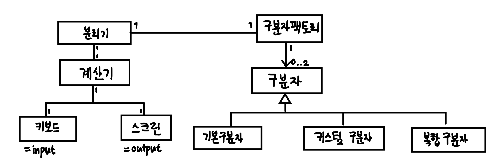

# java-calculator-precourse

# 구현할 기능 목록

> 요구사항에 기능에 따른 커밋을 하라고 기재되어 있으므로, 
> 다음과 같이 기능을 명확히 분리했습니다.  
> 커밋 시 이 기능 외의 테스트, 리펙토링, 문서화 등의 커밋이 추가될 수 있습니다.

- 계산하기
    - [X] 계산기 구축 및 덧셈 설정
    - [X] 예외 처리
- 구분자 찾기
    - [X] 구분자 판별
    - [X] 구분자 만들기
- 숫자 분리하기
    - [X] 문자열을 구분자로 분리
- UI
    - [X] 입력 & 출력 구현
    - [X] 전체 흐름 제어 애플리케이션 컨트롤러 구현

# 비기능적 요구사항

> 다음은 기능 외에 필요한 추가적인 사항입니다. 
> 설계, 리펙토링, 테스트에 관한 부분입니다.  
> 핵심 기능은 아니지만, 품질관리에 필요하기에 기능들 사이에 추가적으로 커밋이 추가될 수 있습니다.

- 설계
    - 도메인 모델 구축
- 리펙토링
    - 패턴 적용
    - 응집도를 높이고 결합도를 낮추자
- 테스트
    - 단위테스트
    - 통합테스트

# 커밋 컨벤션

기본적인 커밋 단위는 위의 설정한 기능 단위로 하며,
그 외의 세부적인 리펙토링, 테스트 등은 따로 작성하겠습니다.

이 경우 커밋 메시지 맨 앞에 타입을 붙여 명확히 명시하겠습니다.

- 기능 구현: `feat`
- 테스트 작성: `test`
- 리펙토링: `refactor`
- 문서화: `docs`
- 기타 변경: `chore`
- 버그 수정: `fix`
- 스타일 변경: `style`

# 설계

### 설계 목표

- 높은 응집도와 낮은 결합도: 각 객체의 책임을 명확히 하여 변경의 파급효과를 최소화하고자 했습니다.
- 확장성: 미래에 새로운 기능이 추가되거나, 변경되어도 유연하게 대처가 가능한 구조를 목표로 했습니다.

### 설계 전략

단일 자바 애플리케이션 프로그램이고, 데이터베이스가 없는 상황에서 ERD를 구축하고 시작하는 것은
과한 설계가 될 것이라고 판단하여, 도메인 모델에 대해서만 설계했습니다.
또한, 구현이 세부적으로 어떻게 되는지를 명시하지만,
이번 프로젝트에서는 리펙토링이 여러 번 진행될 수 있다고 판단하여,
코드를 우선적으로 작성하기로 하였습니다.

책임 주도 설계를 통해 책임을 기반으로 도메인 모델을 구축했습니다. 책임 주도 설계를 기반으로 각 객체의 역할을 분리했습니다.
특히 다양한 구분자를 처리하고, 추후 확장 가능성을 고려하여 구분자를 인터페이스화 하여 유연성을 높이고자 했습니다.

### 책임 상세

- 계산기는 계산해야 할 책임이 존재합니다.
- 구분자 팩토리는 입력 문자열을 분석하여, 구분자 전략을 결정하고, 생성해야 합니다.
- 분리기는 구분자를 이용하여 문자열을 숫자 배열로 분리해야 합니다.
- 키보드와 스크린은 각각 입력과 출력을 해야 합니다.

### 도메인 모델

다음은 도메인 모델을 다이어그램으로 구체화한 그림입니다.  
이 도메인 모델은 과제가 끝날 때까지 지속적으로 수정될 수 있습니다.

# 상세 설명

각 클래스의 역할과 책임에 대해서 상세히 설명합니다.

- Calculator (인터페이스)
    - 계산기의 기본 역할을 정의하는 인터페이스입니다.
    - calculate() 메서드는 문자열을 입력받아 계산 결과를 반환합니다.
- Adder
    - Calculator 인터페이스를 구현하여 덧셈을 하는 역할을 합니다.
    - calculate() 메서드는 문자열의 합을 계산합니다.
- Splitter
    - 구분자를 가져와서 문자열을 분리하는 역할을 합니다.
    - split() 메서드는 주어진 문자열을 구분자로 분리하여 정수 배열로 반환합니다.
    - 문자열을 분리하는 과정에서 구분자를 DelimiterFactory를 통해서 얻어옵니다.
- DelimiterFactory
    - 입력 문자열을 분석하여 적절한 구분자 전략을 결정하고, 구분자를 생성하는 역할을 합니다.
    - findDelimiterFor() 메서드는 입력 문자열을 분석하여 Delimiter 인터페이스를 구현한 객체를 반환합니다.
- Delimiter (인터페이스)
    - 문자열을 분리하는 정책을 정의하는 인터페이스입니다.
    - 주어진 문자열을 처리할 수 있는지를 판별해야 합니다.
    - tokenize() 메서드는 주어진 문자열을 구분자로 분리하여 문자열 배열로 반환합니다.
- BasicDelimiter
    - Delimiter 인터페이스를 구현하여 기본 구분자(, :)를 반환하는 역할을 합니다.
    - 주어진 문자열을 처리할 수 있는지 여부를 판별합니다.
    - tokenize() 메서드는 기본 구분자를 사용하여 문자열을 분리합니다.
- CustomDelimiter
    - Delimiter 인터페이스를 구현하여 커스텀 구분자를 반환하는 역할을 합니다.
    - 주어진 문자열을 처리할 수 있는지 여부를 판별합니다.
    - tokenize() 메서드는 커스텀 구분자를 사용하여 문자열을 분리합니다.
- Keyboard
    - 사용자로부터 입력을 받는 역할을 합니다.
    - read() 메서드는 한 줄의 문자열을 입력받아 반환합니다.
- Screen
    - 결과를 출력하는 역할을 합니다.
    - display() 메서드는 주어진 문자열을 출력합니다.
- CalculateController
    - 애플리케이션의 전체 흐름을 제어하는 역할을 합니다.
    - run() 메서드는 입력을 받고, 계산을 수행하며, 결과를 출력하는 전체 프로세스를 관리합니다.
- Application
    - 프로그램의 진입점 역할을 합니다.
    - 객체를 생성하고 주입시켜주는 역할을 합니다.
    - main() 메서드는 CalculateController의 run() 메서드를 호출하여 프로그램을 시작합니다.

# 예외 처리

예외 상황에 대한 처리는 다음과 같습니다. 추가적으로 구현하면서 발견할 경우 계속 추가할 예정입니다.

예외 메시지에 대해서는 각각의 테스트 코드에서 확인해 볼 수 있으며,
최대한 구체적으로 작성하려고 노력했습니다.

- 문자열에 음수가 포함된 경우
- 커스텀 구분자에 숫자가 포함된 경우
- 커스텀 구분자에 여러개의 구분자가 포함된 경우
- 커스텀 구분자의 형식이 잘못된 경우(ex //*n)
- 구분할 문자열의 형식이 잘못된 경우(ex 1:2::3)
- 숫자가 아닌 값이 포함된 경우(ex 1,a,3)
- 기본 구분자 형태에서 잘못된 형식이 포함된 경우(ex 1,,3)
- 구분자에 공백이 포함된 경우
- 입력 문자열 마지막에 구분자가 오는 경우

입력 문자열에 관련해서 정상적인 입력으로 간주되는 경우는 다음과 같습니다.

- 빈 문자열 `""`
- null

# 구현 중 변경 사항

기존 구현 중 다음과 같은 변경 사항이 있었습니다. 변경 사항은 커밋 내역에서 확인해 볼 수 있습니다.

처음 구현 시 중복 구분자에 관한 부분(ComplexDelimiter)을 허용하였으나,
요구사항에 맞지 않는다고 판단하여 이를 삭제하였습니다.

Delimiter와 Splitter 간의 협력 방식을 변경하였습니다.
Splitter가 Delimiter에게 데이터를 요청하는 형태에서, Delimiter가 Splitter에게 데이터를 제공하는 형태로 변경하였습니다.

# 고민

가장 큰 고민은 커스텀 구분자 요구사항을 어떻게 해석하고 정책을 수립할 것인가였습니다.
처음에는 중복이나, 숫자가 포함된 구분자, 여러 글자의 구분자 등을 모두 허용하는 방향으로 설계를 진행하였습니다.
하지만, 직접 구현을 진행하면서 설계의 복잡도가 늘어나고, 요구사항에 부합하지 않는다는 판단이 들어서
과감히 삭제하고 단순한 단일 구분자만을 허용하는 방향으로 변경하였습니다.

또한, 예외 처리에 관한 부분에 대해서 고민이 많았습니다.
예외 상황을 어느 부분에서 처리해야 하는지에 관해서 가장 고민이 많았습니다.
예를 들어서 구분자를 처리하는 과정에서 하나의 필터를 두어 예외 상황을 처리하는 것인지, 아니면
구분자를 다루는 클래스에서 직접 예외를 처리하는 것인지에 대해서 고민이 많았습니다.
결과적으로 객체의 책임에 따라 예외 처리 위치를 결정했습니다. Splitter는 분리를 책임지고, Delimiter는 구분자를 책임지고, Adder는 덧셈을 책임지므로,
분리된 조각들이 계산에 적합한지를 검증하는 책임은 Adder가 지도록 하였습니다.

테스트 코드에 관한 고민도 많았는데, 각 클래스의 단위 테스트를 어떻게 작성할 것인지에 대해 고민이 많았습니다.
목표는 각 클래스의 기능과 예외 상황을 최대한 검증하는 것이었습니다. 그리고 통합 테스트를 통해서 전체 흐름에 관해 검증하고자 했습니다.
따라서 단위 클래스의 경우에는 경계를 나누어서 작성하고자 노력하였고, 예외를 검증하는 부분도 최대한 포함하고자 했습니다.

구분자를 처리하는 과정에서는 어떻게 해야 변경에 대한 파급효과를 줄일 수 있는가? 에 대해서 고민했습니다.
결과적으로 Delimiter 인터페이스를 도입하여 구분자 처리 정책을 분리하였고,
DelimiterFactory를 통해서 구분자 생성 책임을 위임함으로써,
향후 새로운 구분자 정책이 추가되더라도 기존 코드를 수정하지 않고 확장할 수 있도록 했습니다.

# 배운 점

컴파일러와 자연어 처리 수업을 통해 정규표현식을 배웠기에 '안다'라고 생각했지만, 막상 Java로 사용하려고 하니,
익숙하지 않아서 어려움이 있었습니다. Pattern과 Matcher 클래스를 이용해서 정규표현식을 통해 문자열을 처리하는 방법에 대해서 익힐 수 있었습니다.
특히 \n 과 \\n과 같은 차이점에 대해서 알 수 있었고, *과 같은 특수문자를 처리하기 위해 `Pattern.quote()`메서드를 사용하는 방법도 배울 수 있었습니다.

처음에는 Calculator 클래스에서 분리와 덧셈으로 모두 책임지는 모델을 생각하였고, Calculator와 Delimiter가 서로 협력하는 것에 대해서 생각했지만,
Calculator가 무거워지고, 코드가 복잡해졌음을 알 수 있었습니다. 또한, Splitter가 Delimieter가 협력하는 것이 협력 과정에서 더욱 자연스럽다는 것을 통해서 도메인 모델을 재설정했습니다.
이렇게 도메인 모델과 코드가 계속해서 영향을 미치며 변경된다는 것을 깨달을 수 있었습니다. 또한 이를 통해서 단일 책임 원칙(SRP)을 더욱 깊이 이해할 수 있었습니다.

테스트하는 과정에서 단순히 기능을 잘 작동하는지 확인하는 도구 정도로 생각했었지만, 막상 테스트 코드를 진행하다 보니, 막상 생각하지 못했던 예외나 오류에 대해서
빠르게 검출해 낼 수 있었습니다. 이를 통해서 코드의 품질을 높이고, 기술 부채를 줄일 수 있는 도구라는 것을 깨달을 수 있었습니다.
또한, 테스트 코드를 보며 각각의 기능들의 동작이 명확하고 구체적으로 이해가 가능하다는 점을 알 수 있었습니다.
이러한 테스트 코드가 일종의 문서 역할을 한다는 점도 깨달을 수 있었고, 중요하다는 것도 알게 되었습니다.

# 테스트

각 클래스에 대한 단위 테스트가 작성되었습니다.
각 테스트 클래스는 해당 클래스의 주요 기능과 예외 상황을 검증합니다.
테스트는 코드 커버리지를 최대한 높이기 위해 다양한 시나리오를 포함하고자 했습니다.

통합 테스트는 ApplicationTest 클래스에서 수행됩니다.
이 테스트는 전체 애플리케이션의 흐름을 검증하며, 다양한 입력 시나리오에 대한 결과를 확인합니다.

테스트는 Junit 5 프레임워크를 사용하여 작성되었으며, 각 테스트는 독립적으로 실행될 수 있도록 설계되었습니다.

테스트에 대한 세부 사항은 다음과 같습니다.

- 메서드_기능_반환() 으로 작성하였습니다. 또한 @DisplayName()에는 한글로 기능 설명을 기재하여 가독성을 높였습니다.
- 예외 상황은 assertThatThrownBy() 메서드를 사용하여 검증하였고, 예외 메시지도 함께 확인하였습니다.
- 각 테스트 클래스는 @BeforeEach 어노테이션을 사용하여 공통적으로 필요한 객체를 초기화합니다.

# 리펙토링

리펙토링 과정에서는 다음과 같은 원칙을 적용했습니다.
Splitter 와 Delimiter 간의 협력에서 Splitter는 Delimiter에게 데이터를 요청해서 받아오는 형태로 처리를 했었습니다.
하지만, 이런 형태는 Splitter가 Delimiter에 강하게 결합되는 형태라고 생각했습니다.

따라서 Tell, Don't Ask 원칙을 적용하여 Splitter가 Delimiter에게 데이터를 요청하는 형태에서,
Delimiter가 Splitter에게 데이터를 제공하는 형태로 변경했습니다.
왜냐하면 직접 분리를 하는 로직은 구분자에 대한 가장 많은 정보를 가지고 있는 Delimiter가 처리하는 것이
더욱 자연스럽다고 판단했기 때문입니다.

getRegex() 메서드와 getContent() 메서드를 없애고 Delimiter 인터페이스에 tokenize() 메서드를 추가하여
Delimiter가 스스로 문자열을 분리하는 책임을 가지도록 변경했습니다.
이를 통해서 Splitter가 Delimiter의 내부 구현에 의존하지 않도록 변경했습니다

즉, Delimiter 자체가 데이터를 처리해서 Splitter에게 결과만을 제공해주는 형태로 변경하였습니다.
이를 통해서 Splitter와 Delimiter 간의 결합도를 낮추고, 응집도를 높일 수 있었습니다.